<p align="center">
  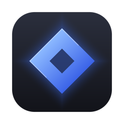
</p>

<h1 align="center">GetCraft</h1>

<p align="center">
  <b>One place to install and update the open-source Crafting Apps.</b><br>
  PhotoCraft, VectorCraft, FilmCraft, LightCraft and the rest, in one click, kept up to date,<br>
  without GitHub accounts, release pages or manual downloads.
</p>

<p align="center">
  
  
  
  
  <a href="https://github.com/mbirnbach/getcraft/actions/workflows/ci.yml"></a>
</p>

> [!IMPORTANT]
> **GetCraft is an independent, community-made project.** It is not made, sponsored or endorsed
> by the ArtCraft team. The Crafting Apps it installs are made by the
> [ArtCraft](https://getartcraft.com/) team and community, and GetCraft downloads them unchanged
> from their official GitHub releases. Problems with an app itself belong in that app's
> repository; problems with installing or updating belong [here](https://github.com/mbirnbach/getcraft/issues).

<p align="center">
  <a href="#features">Features</a> ·
  <a href="#supported-apps">Supported apps</a> ·
  <a href="#download">Download</a> ·
  <a href="#how-it-works">How it works</a> ·
  <a href="#development">Development</a> ·
  <a href="#privacy">Privacy</a> ·
  <a href="#code-signing-policy">Code signing</a> ·
  <a href="#license-and-credits">License and credits</a>
</p>

<br>

<p align="center">
  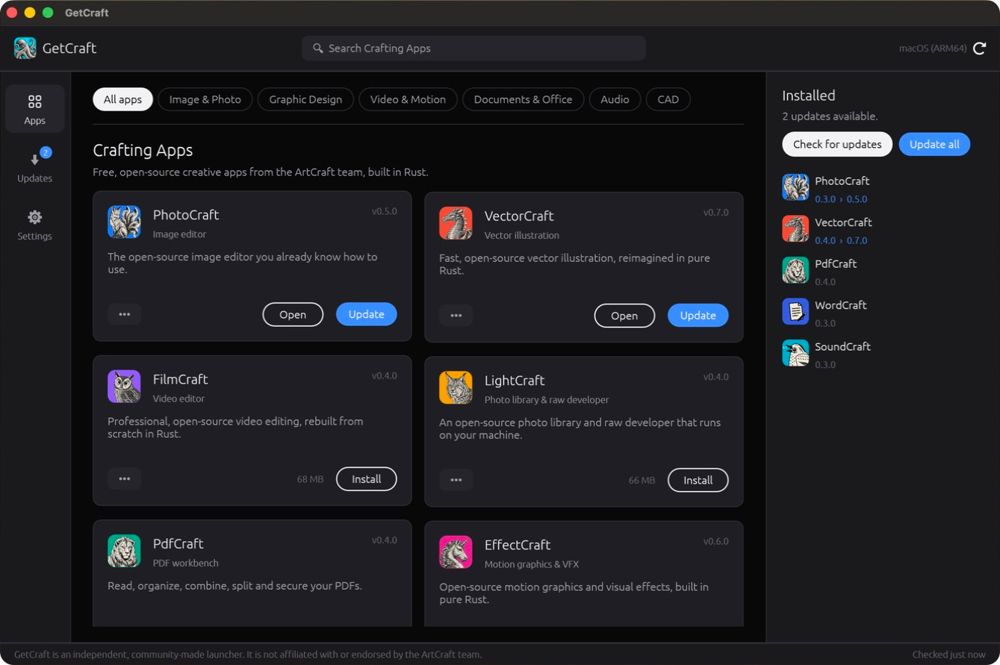
  <br>
  <sub>The catalog. Apps you already have, even ones installed by hand, show up under Installed.</sub>
</p>

## Features

- **One-click installs.** GetCraft picks the right build for your computer (macOS universal,
  Windows x64/ARM64/x86, Linux x86_64/ARM64) and installs it without asking for admin rights.
- **Verified downloads.** Every download comes straight from the app's official GitHub release
  and is checked against the SHA-256 checksums the project publishes.
- **Updates your way, per app.** Get notified about new versions, have them installed
  automatically, or ignore an app. Apps are never replaced while they're open.
- **Finds what you already have.** Apps you installed by hand are recognised and kept up to date
  too.
- **Quietly in the background.** Closing the window leaves GetCraft in the menu bar or system
  tray, where it keeps checking. It can start at login, and it updates itself.
- **New apps appear automatically.** When the ArtCraft team publishes a new Crafting App,
  GetCraft lists it under *New on GitHub* without needing an update.

<table>
  <tr>
    <td width="50%">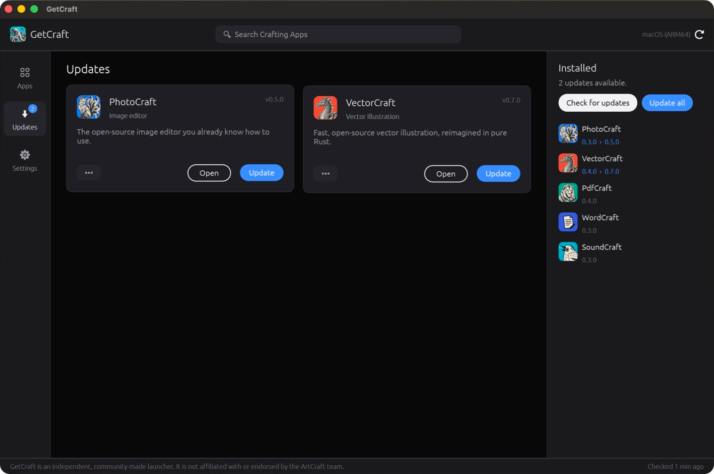</td>
    <td width="50%">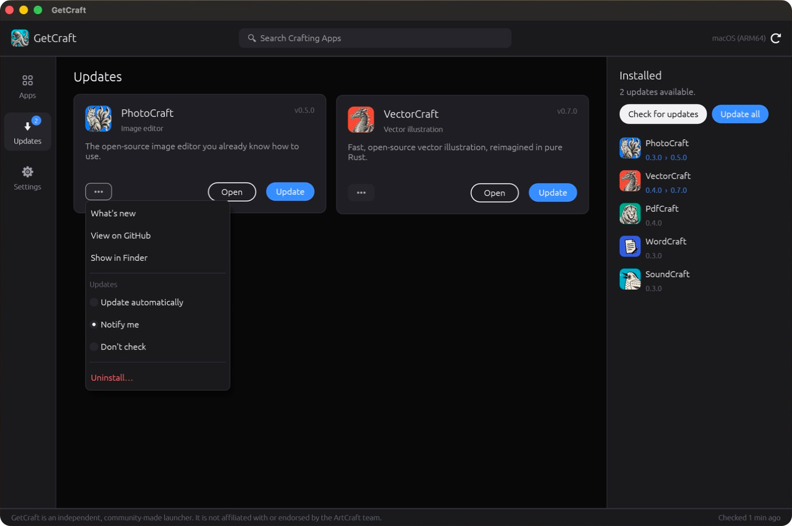</td>
  </tr>
  <tr>
    <td align="center"><sub>Pending updates in one place.</sub></td>
    <td align="center"><sub>Release notes, the per-app update setting and uninstall.</sub></td>
  </tr>
</table>

## Supported apps

GetCraft knows these Crafting Apps today and picks up new ones on its own.

| | App | What it is | Project |
|---|---|---|---|
| 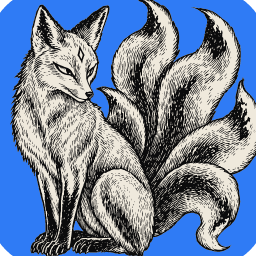 | **PhotoCraft** | Image editor | [GitHub](https://github.com/storytold/photocraft) · [Website](https://getartcraft.com/apps/photocraft) |
| 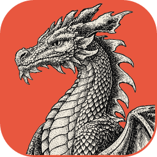 | **VectorCraft** | Vector illustration | [GitHub](https://github.com/storytold/vectorcraft) · [Website](https://getartcraft.com/apps/vectorcraft) |
| 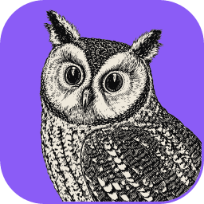 | **FilmCraft** | Video editor | [GitHub](https://github.com/storytold/filmcraft) · [Website](https://getartcraft.com/apps/filmcraft) |
| 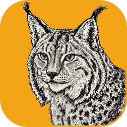 | **LightCraft** | Photo library and raw developer | [GitHub](https://github.com/storytold/lightcraft) · [Website](https://getartcraft.com/apps/lightcraft) |
| 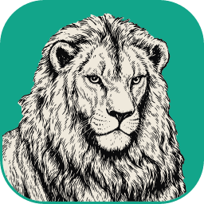 | **PdfCraft** | PDF workbench | [GitHub](https://github.com/storytold/pdfcraft) · [Website](https://getartcraft.com/apps/pdfcraft) |
| 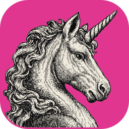 | **EffectCraft** | Motion graphics and VFX | [GitHub](https://github.com/storytold/effectcraft) · [Website](https://getartcraft.com/apps/effectcraft) |
| 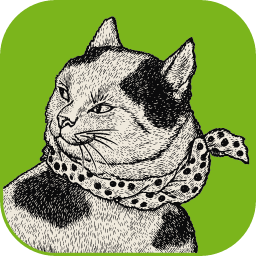 | **DesignCraft** | Page layout and publishing | [GitHub](https://github.com/storytold/designcraft) · [Website](https://getartcraft.com/apps/designcraft) |
| 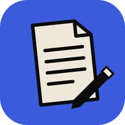 | **WordCraft** | Word processor | [GitHub](https://github.com/storytold/wordcraft) |
| 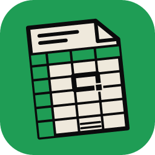 | **GridCraft** | Spreadsheets | [GitHub](https://github.com/storytold/gridcraft) |
| 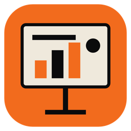 | **DeckCraft** | Presentations | [GitHub](https://github.com/storytold/deckcraft) |
| 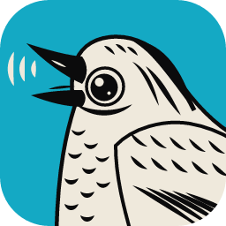 | **SoundCraft** | Audio workstation | [GitHub](https://github.com/storytold/soundcraft) |
| 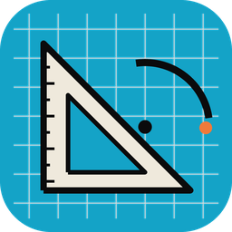 | **CADCraft** | CAD and drafting | [GitHub](https://github.com/storytold/cadcraft) |

The apps are free and open source, made by the ArtCraft team and community. Learn more about
them, and about ArtCraft itself, at [getartcraft.com/apps](https://getartcraft.com/apps).

## Download

Get the latest version from the [releases page](https://github.com/mbirnbach/getcraft/releases):

| System | File |
|---|---|
| macOS 11+ (Apple silicon and Intel) | `getcraft-<version>-macos-universal.dmg` |
| Windows 10/11 x64 | `getcraft-<version>-windows-x64-portable.zip` |
| Windows 11 on ARM | `getcraft-<version>-windows-arm64-portable.zip` |
| Linux x86_64 / ARM64 | `getcraft-<version>-linux-<arch>.AppImage` |

> [!NOTE]
> The macOS app is signed and notarized by Apple. The Windows build isn't code-signed yet, so
> Windows SmartScreen may say *"Windows protected your PC"* the first time you open it: click
> **More info → Run anyway**. GetCraft's own updates after that aren't affected. Signed Windows
> builds are on their way (see [Code signing policy](#code-signing-policy)).

Installed apps go to:

| System | Location | Shows up in |
|---|---|---|
| macOS | `/Applications` (or `~/Applications` without admin rights) | Launchpad and Spotlight |
| Windows | `%LOCALAPPDATA%\Programs\GetCraft\<app>` (portable build) | Start menu |
| Linux | `~/.local/share/getcraft/apps/<app>` (AppImage) | Application menu |

The first time it runs, GetCraft asks whether it may start when you log in. It never changes
your login items without asking, and the choice can be changed in Settings.

### Uninstalling GetCraft

Apps installed with GetCraft stay installed when you remove GetCraft. To remove one, use its
••• menu → *Uninstall* first (on macOS it goes to the Trash).

1. Open GetCraft's Settings and turn off *Start GetCraft when I log in*.
2. Quit GetCraft from the menu bar (macOS) or system tray (Windows, Linux): *Quit GetCraft*.
3. Delete GetCraft itself: `GetCraft.app` on macOS, the `GetCraft` folder you unpacked on
   Windows, or the `.AppImage` on Linux.
4. Optionally delete its settings and cache:

| System | Folders |
|---|---|
| macOS | `~/Library/Application Support/GetCraft`, `~/Library/Caches/GetCraft` |
| Windows | `%APPDATA%\GetCraft`, `%LOCALAPPDATA%\GetCraft` |
| Linux | `~/.config/GetCraft`, `~/.cache/GetCraft` |

## How it works

```
apps/getcraft          the desktop app (Rust and egui, like the Crafting Apps themselves)
apps/getcraft-index    builds index.json, run by CI every 30 minutes
crates/getcraft-core   catalog, GitHub client, asset matching, installers, update engine
catalog.toml           the curated list of apps: names, descriptions, categories
```

GitHub allows only 60 unauthenticated API requests per hour per IP address. Instead of every
copy of GetCraft querying every repository, the *Release index* workflow collects the latest
release of every app (and of GetCraft) into one `index.json` on the `index` branch. GetCraft
downloads that single file and only asks GitHub directly if it's unavailable.

To add an app or change how one is described, edit [`catalog.toml`](catalog.toml). The change
reaches everyone through the index; no GetCraft release is needed.

## Development

```bash
cargo run -p getcraft                                 # run the app
cargo test --workspace                                # unit tests
cargo run -p getcraft-core --example smoke pdfcraft   # live end-to-end install into a temp folder
scripts/bundle-macos.sh debug                         # build target/bundle/GetCraft.app
scripts/build-dmg.sh target/bundle/GetCraft.app GetCraft.dmg  # pack it into the styled DMG (pip install dmgbuild)
cargo run --release -p getcraft --example make_icon   # rebuild the app icons from assets/getcraft-source.png
```

Releases are built by pushing a `v*` tag (see [`release.yml`](.github/workflows/release.yml) and
[`docs/SIGNING.md`](docs/SIGNING.md)). Builds without a notarized macOS app are published as
pre-releases, which GetCraft's self-updater ignores.

Useful environment variables:

- `GETCRAFT_INDEX_URL` points at a different `index.json`, e.g. a local one.
- `GETCRAFT_GITHUB_TOKEN` is used for direct API calls and lifts the rate limit while developing.
- `GETCRAFT_TREAT_AS_INSTALLED=1` lets a development build register the login item.
- `RUST_LOG=debug` turns on verbose logging.

## Privacy

GetCraft has no accounts, analytics or telemetry. It only connects to GitHub, to check for new
versions and to download the apps you choose. The [privacy policy](PRIVACY.md) lists every
address it contacts and everything it stores on your computer.

## Code signing policy

Free code signing for Windows is provided by [SignPath.io](https://about.signpath.io/), certificate
by [SignPath Foundation](https://signpath.org/). macOS builds are signed with the maintainer's
Apple Developer ID and notarized by Apple.

Only binaries built from this repository by its GitHub Actions
[release workflow](.github/workflows/release.yml) are signed, and every signing request is
approved by hand.

| Role | Members |
|---|---|
| Authors (committers) | [@mbirnbach](https://github.com/mbirnbach) |
| Reviewers | [@mbirnbach](https://github.com/mbirnbach) |
| Approvers | [@mbirnbach](https://github.com/mbirnbach) |

Privacy policy: see [PRIVACY.md](PRIVACY.md). GetCraft only transfers information to the GitHub
services listed there, as needed to check for and download updates.

## License and credits

GetCraft's code is dual-licensed under [MIT](LICENSE-MIT) or [Apache-2.0](LICENSE-APACHE), at
your option. Copyright (c) 2026 the GetCraft contributors. Required notices are in
[NOTICE](NOTICE).

The GetCraft artwork (the engraved octopus app icon in `assets/getcraft*` and the DMG background
in `assets/dmg/`) is **not** covered by that license. It may be used only as part of GetCraft and
this repository; forks and modified versions must replace it. See [`assets/LICENSE-icon.txt`](assets/LICENSE-icon.txt).

The Crafting Apps' icons in [`assets/icons/`](assets/icons/) are copies of the icons in each
app's repository, used under those projects' MIT license, with their copyright notices in
[ATTRIBUTION.md](ATTRIBUTION.md). Every other non-code asset is listed there too.

<sub>ArtCraft is a trademark of the ArtCraft Team. PhotoCraft, VectorCraft, FilmCraft,
LightCraft, PdfCraft, EffectCraft, DesignCraft, WordCraft, GridCraft, DeckCraft, SoundCraft and
CADCraft are projects of the ArtCraft Team and their contributors. These names are used only to
identify the apps GetCraft installs. GetCraft does not use the ArtCraft wordmark or logo, and it
is not affiliated with, sponsored by or endorsed by the ArtCraft Team.</sub>
